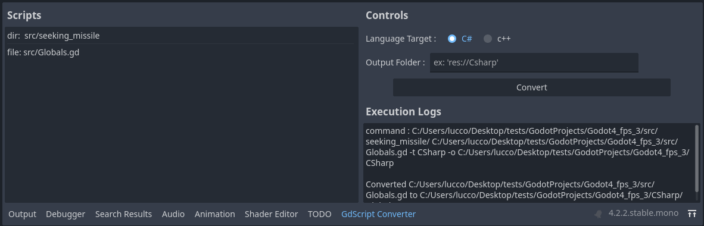

## GdScript2All
A tool for converting [Godot](https://github.com/godotengine/godot)'s GdScript to other languages (currently C# and c++) with features like type inference. Requires [Python installed](https://www.python.org/downloads/) (tested with 3.12.5).  

#### Editor addon
Available from the Asset Lib tab in editor or alternatively [download as zip](https://github.com/Lcbx/GdScript2All/zipball/main/) and extract into your project.  
Enable in Project Settings->Plugins then you're set.  
To use, drag&drop files and folders from the FileSystem dock then click convert.  



#### From the command line
call the main script using your favorite command line utility (add ```-t Cpp``` for c++) :
```bash
python addons/gd2all/converter/main.py <file_or_folder_path> -o <output_file_or_folder_path>
```

### Example
script input :
```GDScript
__test.gd__
```
C# output :
```cs
__test.cs__
```
c++ output (header) :
```c++
__test.hpp__
```
c++ output (implementation) :
```c++
__test.cpp__
```

### Limitations
- generated code might need corrections !
- pattern matching - a complicated form of the match case statement - is not be supported
- when the parser encounters something unexpected it will drop the current line and resume at the next (panic mode). this might result in mangled output.
- read [TODO.md](TODO.md) for missing features
- C# : godot won't build C# scripts until you have created at least one C# script manually in the editor
- c++ : generated code does a best guess on what whould be pointers/references
- c++ : accessing/modifying parent class properties does not use getters/setters (this is a conscious choice)

### Updating the API definition
* download the offical godot repo
* copy it's ```doc/classes``` folder and paste it into our ```classData``` folder
* install untangle (xml parsing library) if you don't have it (```pip install untangle```)
* run ```py ./addons/gdscript2all/converter/src/godot_types.py``` to generate the pickle class db
* profit.

### Adding new languages
If you want to transpile to an unsupported language, rename a copy of the [C# transpiler backend](src/CsharpTranspiler.py),
modify it as needed, then to use it you just have to pass its name with the ```-t``` flag (example below with c++ transpiler):
```bash
python ./addons/gdscript2all/converter/main.py -t Cpp <file_or_folder_path>
```

### Explaining the GPL-3.0 license
The code this tool generates from your GDScipt is yours.
However, any improvment made to this tool's source has to be contributed back.
I think that's fair.
  
<a href="https://www.buymeacoffee.com/Lcbx" target="_blank"></a>

